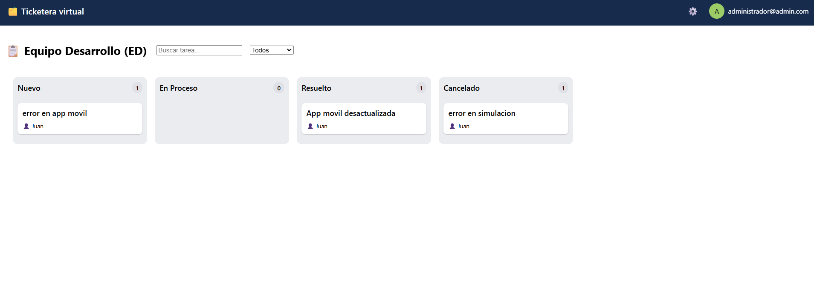
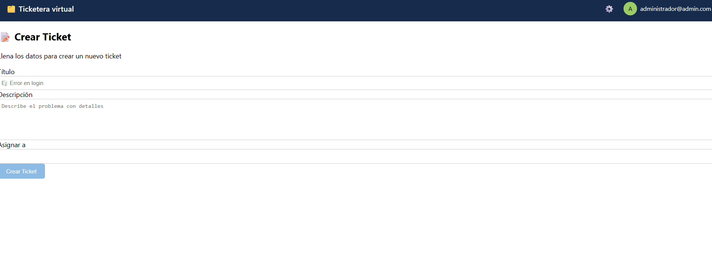
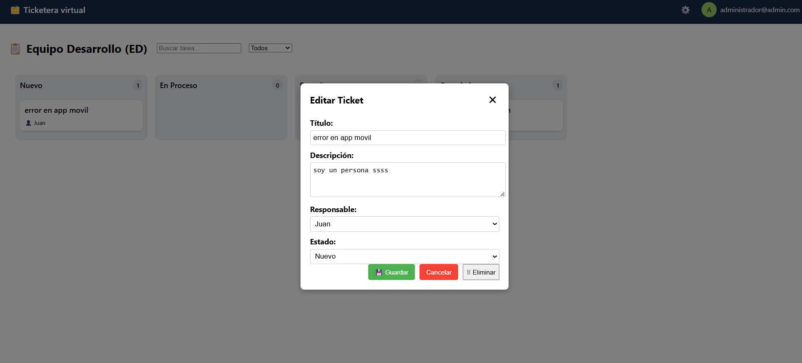

Frontend-Ticketera

Aplicación web full stack para la gestión de tickets, desarrollada con Angular la parte Frontend. Permite crear, editar, filtrar y eliminar tickets, asignar responsables y gestionar estados.

🚀 Tecnologías utilizadas
Angular = 21.2.3
TypeScript
HTML / CSS

⚙️ Funcionalidades
✅ Crear tickets
✅ Editar tickets
✅ Eliminar tickets
✅ Cambiar estado (Nuevo, En Proceso, Resuelto, Cancelado)
✅ Asignar responsable
✅ Filtrar por estado
✅ UI tipo tablero (estilo Jira)

📦 Uso

✅ npm install 
✅ ng serve

Si hubiera tenido mas tiempo

Hubiera colocado la funcion de colocar comentarios en los tickets y ver que persona lo coloco tipo Jira.

Decisiones tecnicas

- Opte por forzar la carga en angular porque la sincronizacion en la vista no era en tiempo real.

Capturas de pantalla

